# AWS Differentiators

---

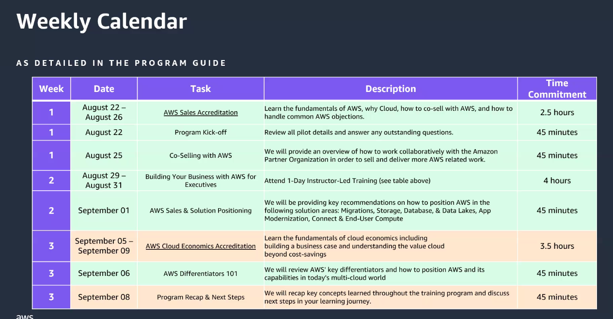

---

- [ ] See program guide

---

## Differentiators Overview

### Customer Stories

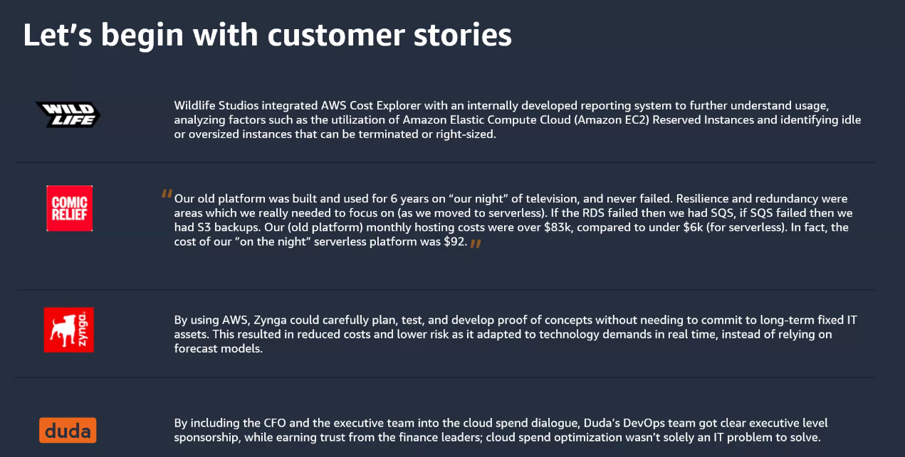

### Customer POV

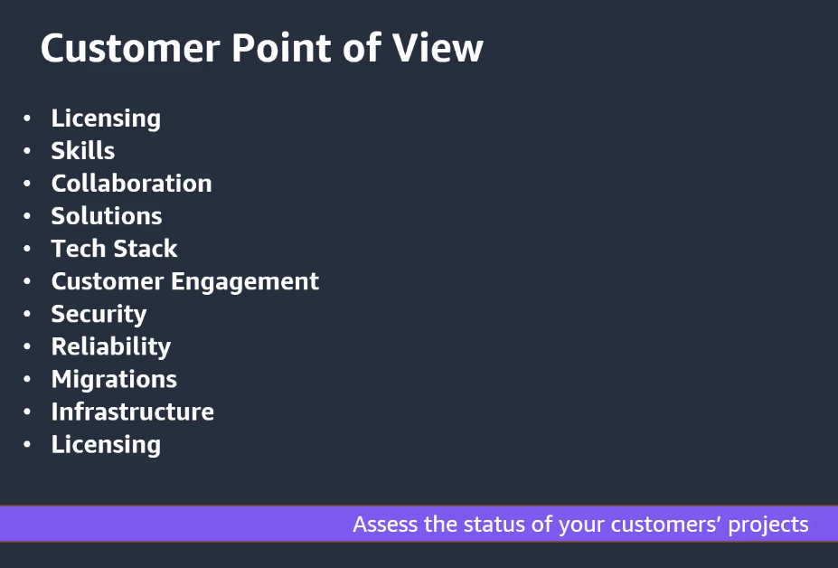

### What sets AWS apart?

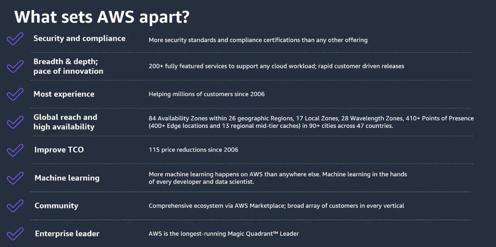

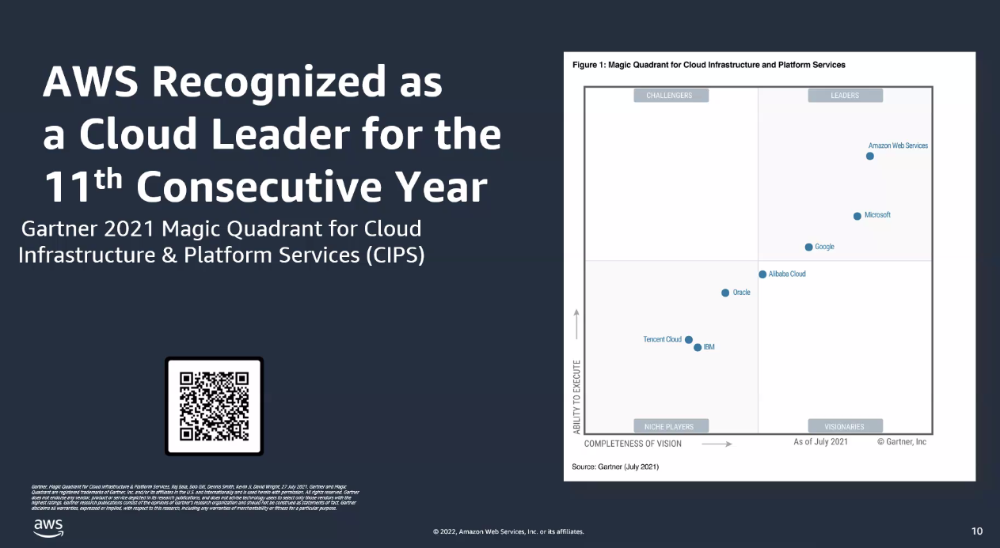

---

## Security and Compliance

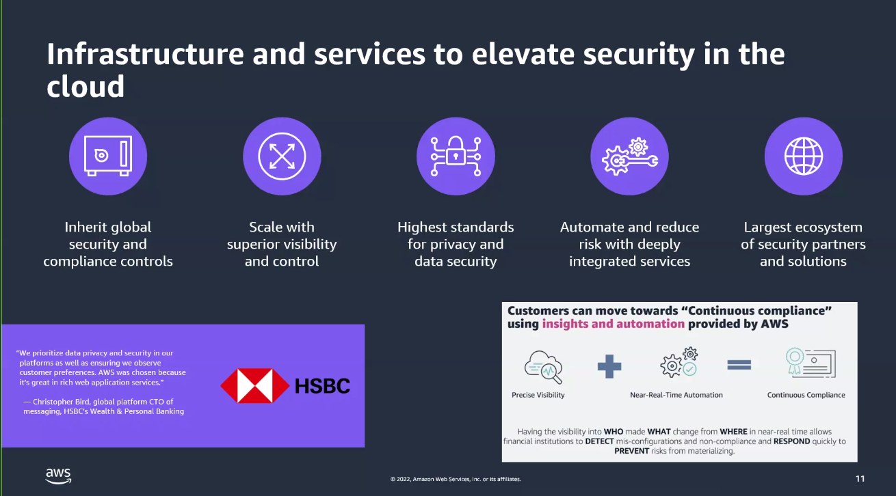

---

## Depth and Breadth of Services

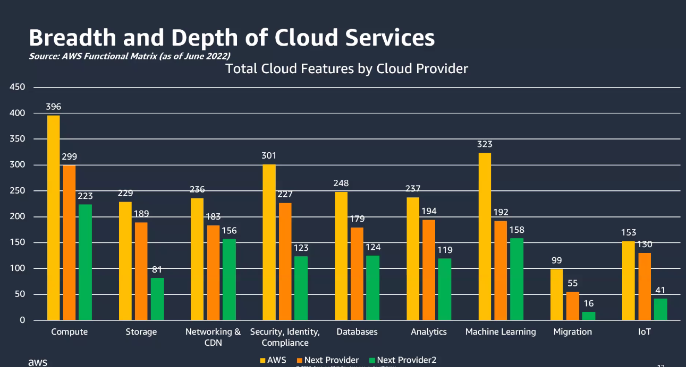

---

## Global Infrastructure

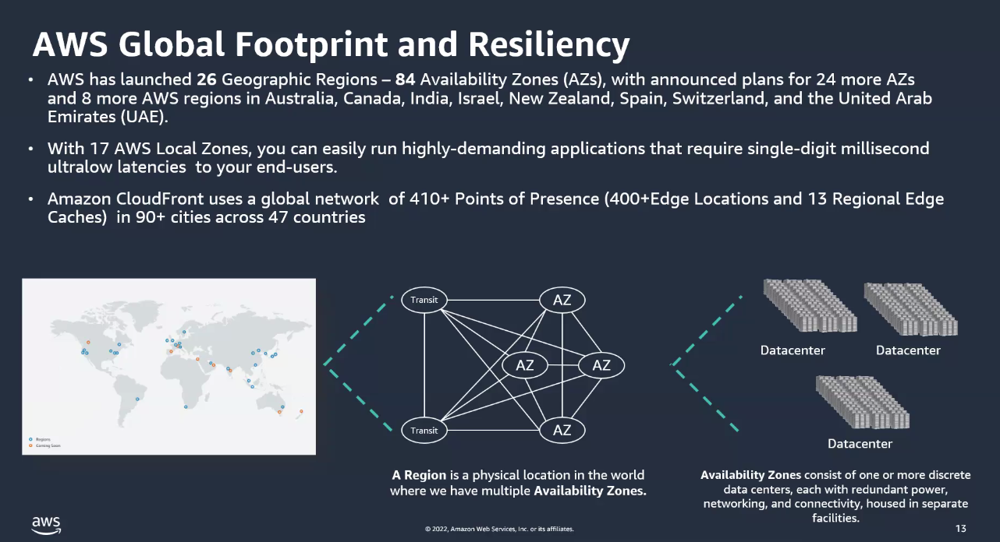

---

## Marketplace

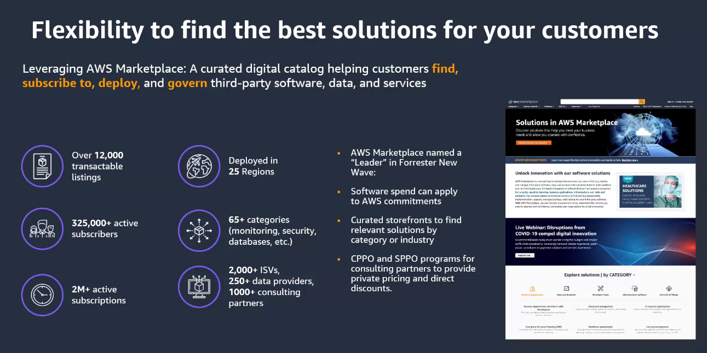

---

## Partner Programs

---

## Discounts

### Compute

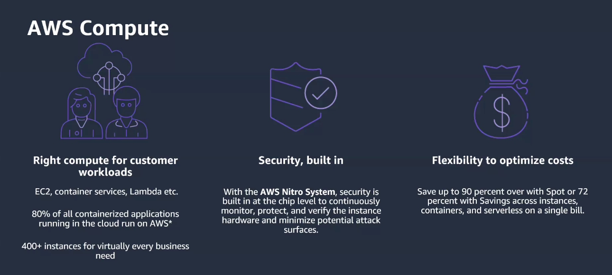

- 2-minute warning vs 30-sec Google / Azure

---

## AI/ML

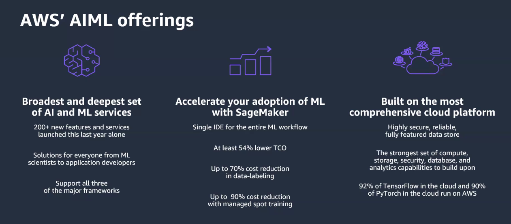

---

## Sustainability

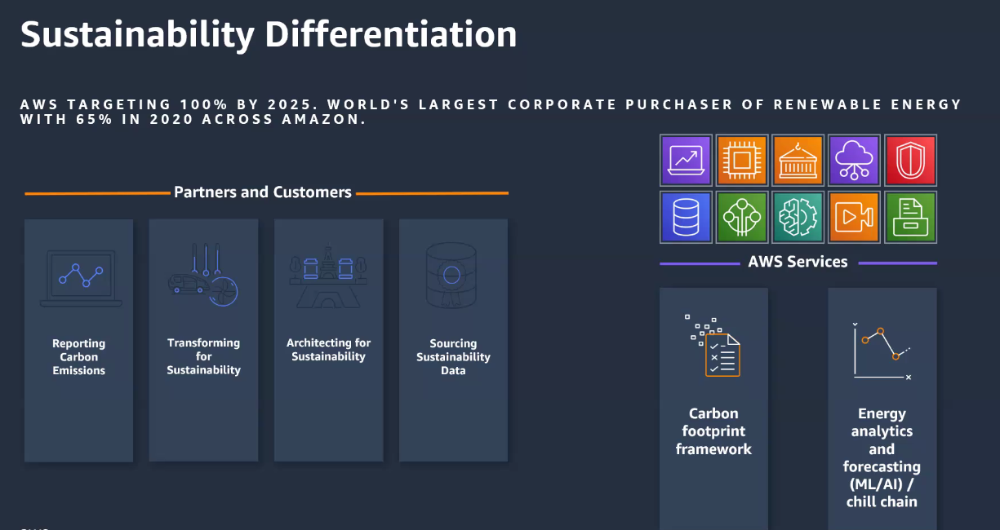

- Customer carbon footprint tool
- Forecasted emissions trends
- 100% Renewable by 2025
- Energy management options

---

## Summary

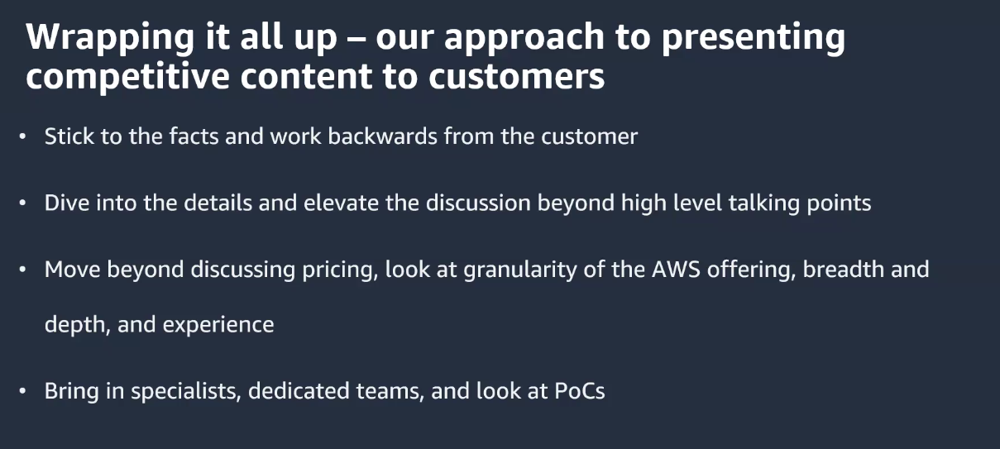

---

## Next Steps

- [ ] Complete Cloud Economics Accreditation
- [ ] 