# AWS Sales & Solution Positioning

---

## Questions for customers

- Where are you in your cloud journey?
- What is your timeframe?
- How fmailiar are you with theis AWS service?
- What are your desired business outcome

---

### Customer wants

- Sam eexperience across on-premesism edge, and cloud
- SSame operational consistency

---

### Pricing models

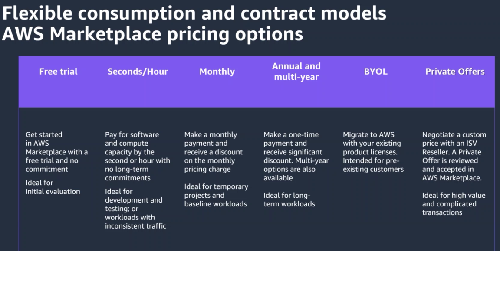

### Migrations

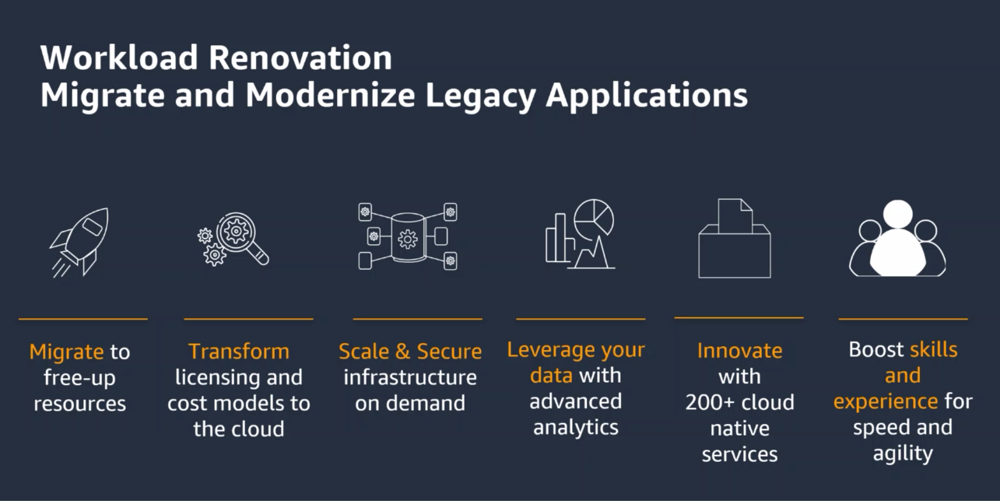

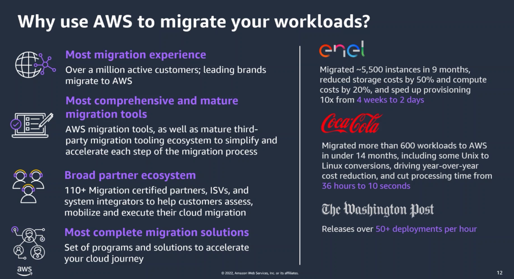

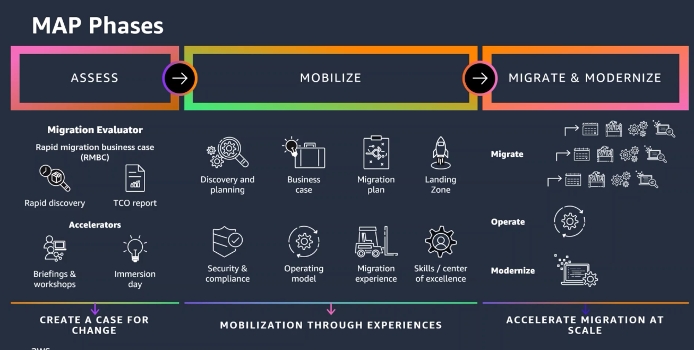

---

## Storage, Database, and Data Lakes

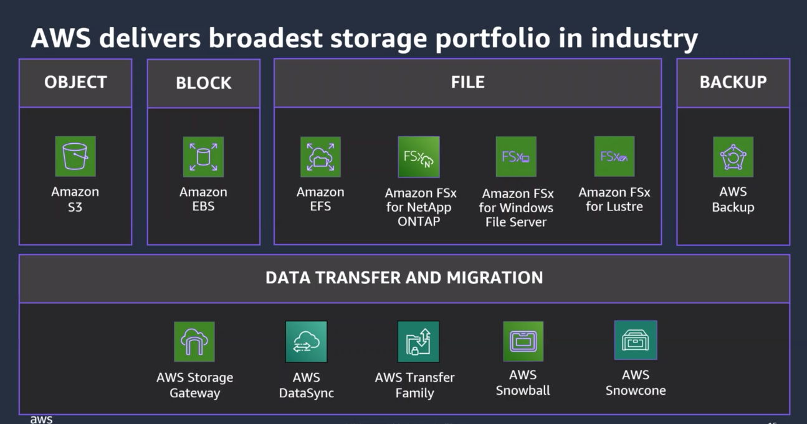

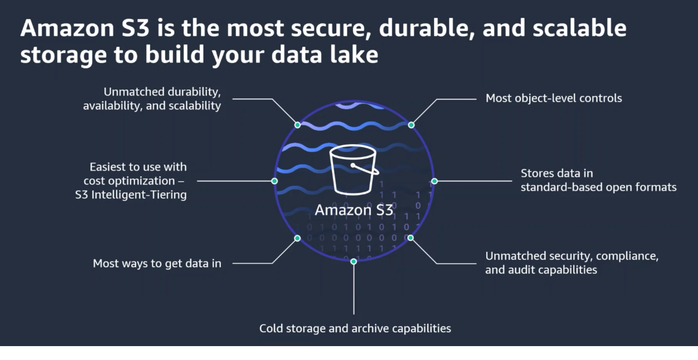

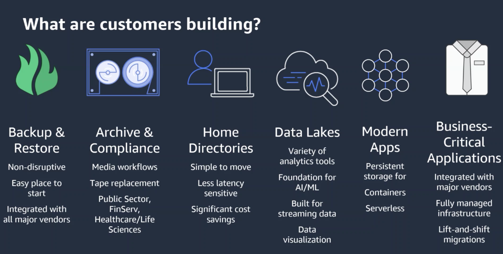

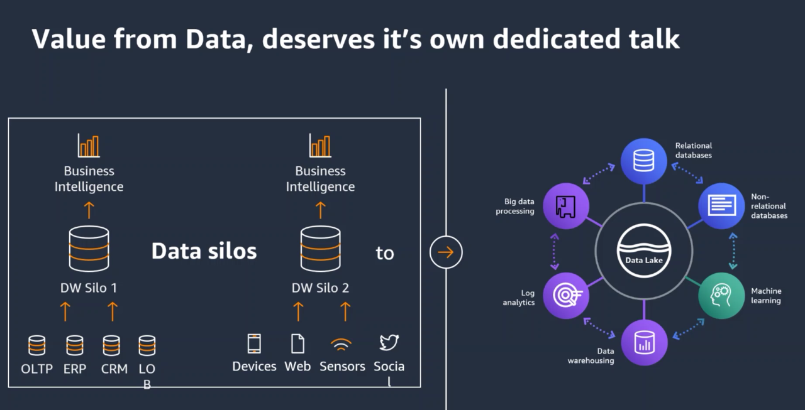

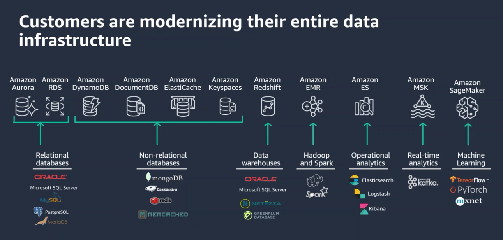

---

## Application Modernization

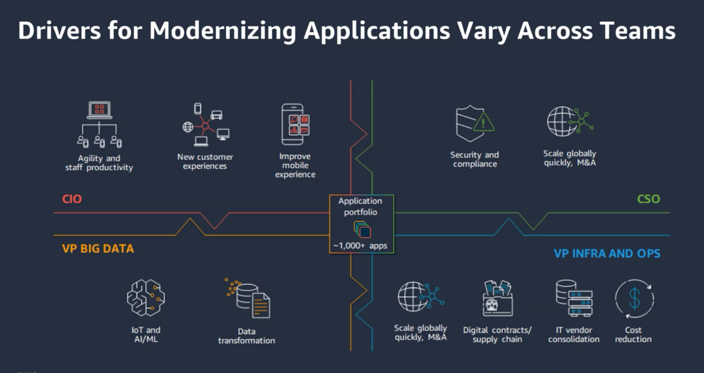

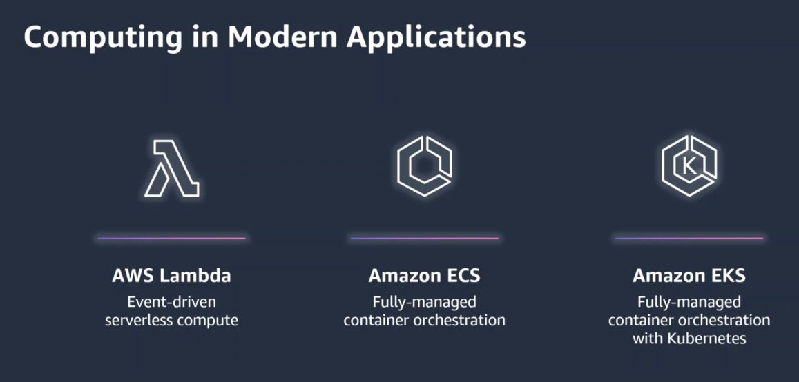

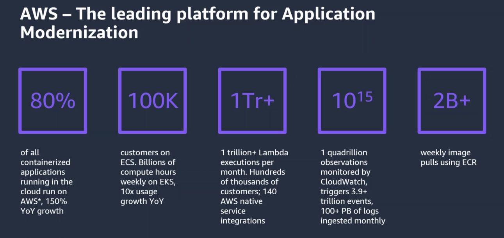

---

## Business Cases

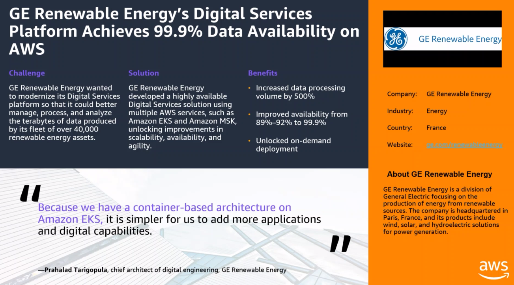

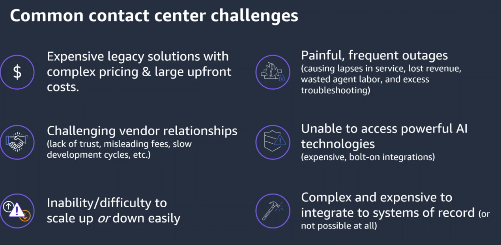

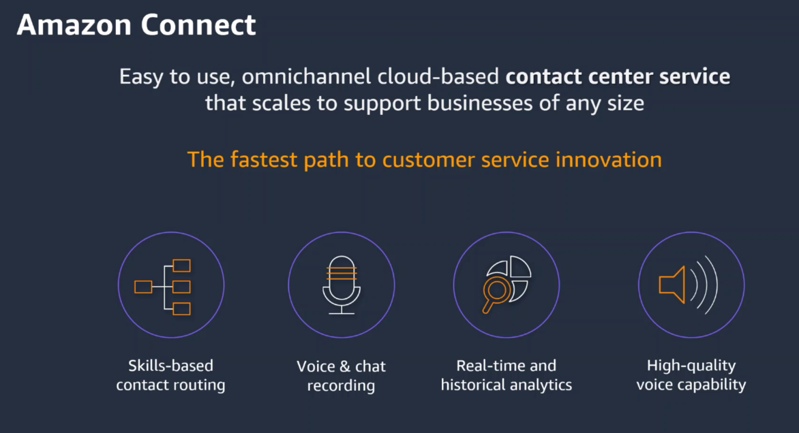

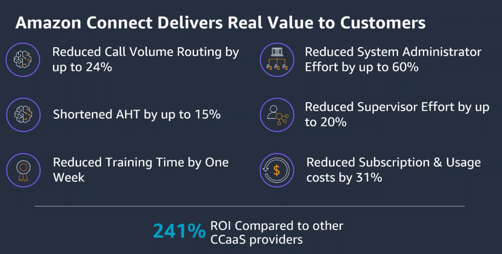

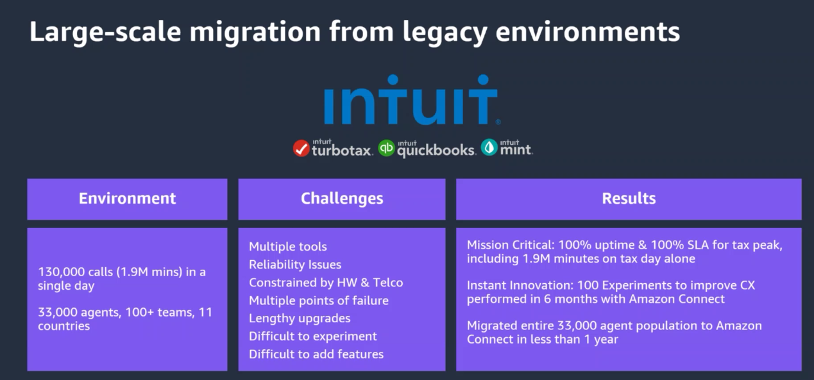

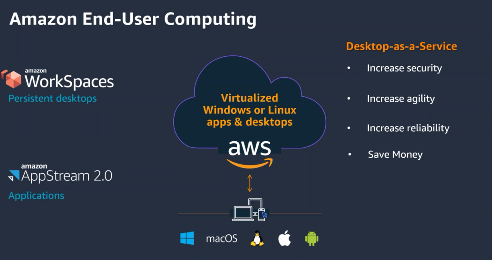

---

## Conclusion

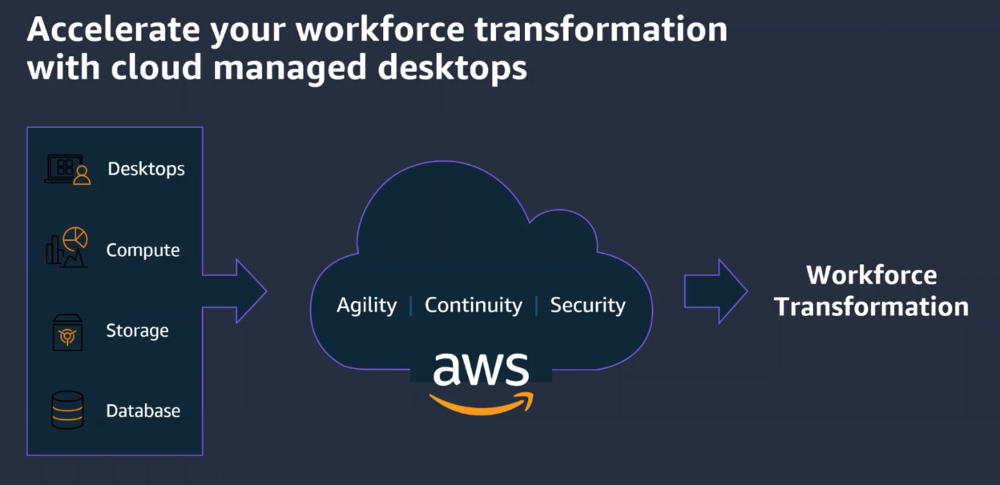

---

## Next Steps

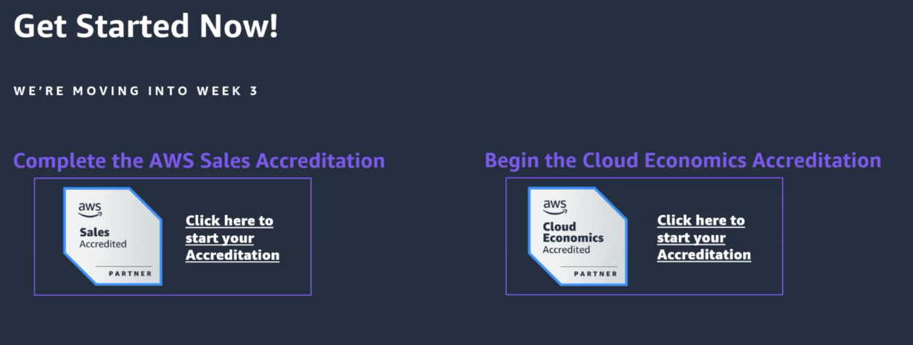

