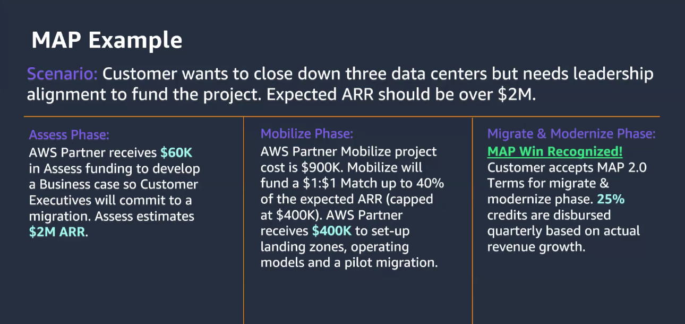

# Co-selling with AWS

- ACE
- MAP - Migration Acceleration Program
- Roles
  - PDM - Parther Development Manager
    - Business goal alignment
    - Grow partnership
    - Education on resources and tools
    - Go to market campaigns
  - AM - Account Manager
    - Customer relationships
    - AWS Adoption
    - Contracts and pricing
  - PSA / SA Partner and Field Solutions Architect
    - Technical strategy
    - AWS Adoption
    - Technical resources
    - Assist building AWS architectures
  - PSM - Partner Success Manager
    - Partner service adoption
    - Works with customers
    - Owns funding mechanisms
  
## Co-sell Process

## Questions

## Managing AWS Opportunities (ACE)

- Pipeline for tracking sales

## MAP - Migration Ambassador

- 1 hr video course
- 30 question
- Migration Ambassaor

---

## Next steps

- [ ] 
