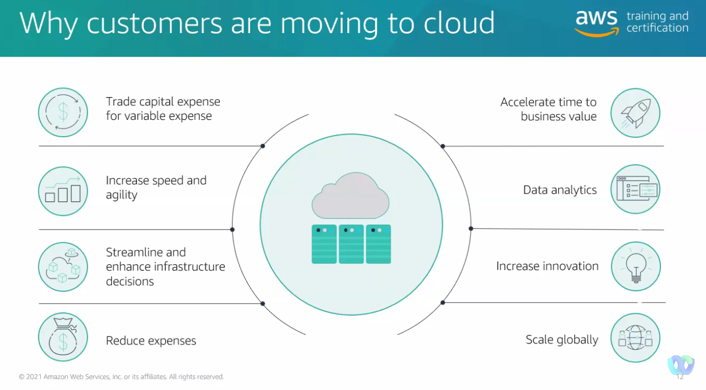
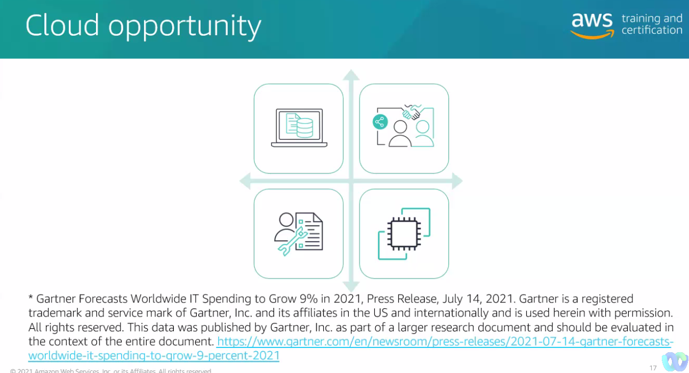
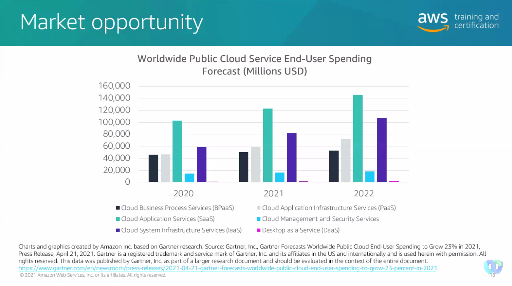

# Instructor-led AWS Executive Training

> 29AUG22 | John Mckenna - Sr. Partner trainer | Aktrese Gattett - Partner trainer

## Course Objectives

- Explain opportunities in the cloud
- Identify cloud trends impacting customers and business model
- Best practives to integrate cloud into your business
- How to work with AWS and AWS Partner benefits

## Overview

1. Why Cloud?
2. How to integrate cloud into your business
3. Partnering with AWS
4. How to become profitable with AWS
5. Differentiating your business
6. Building your business and next steps

## I Why Cloud?

- Primary paradigm in IT services at the moment

