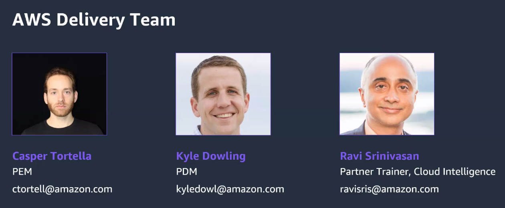
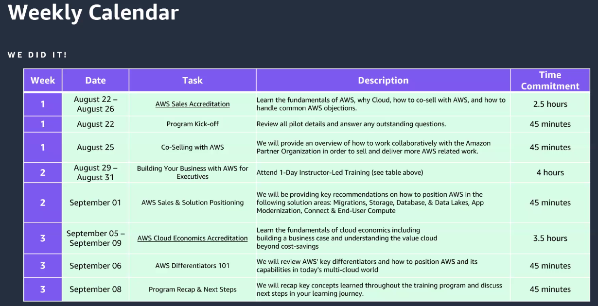
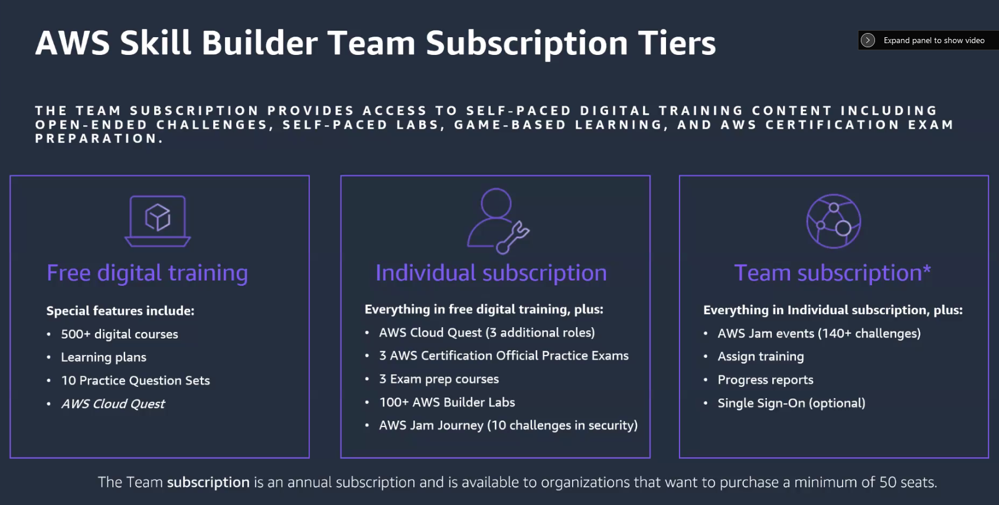
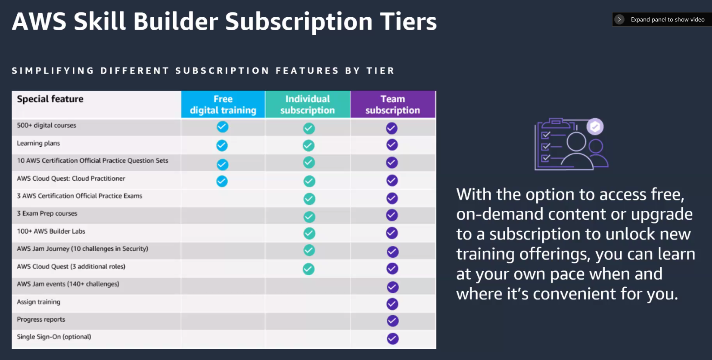
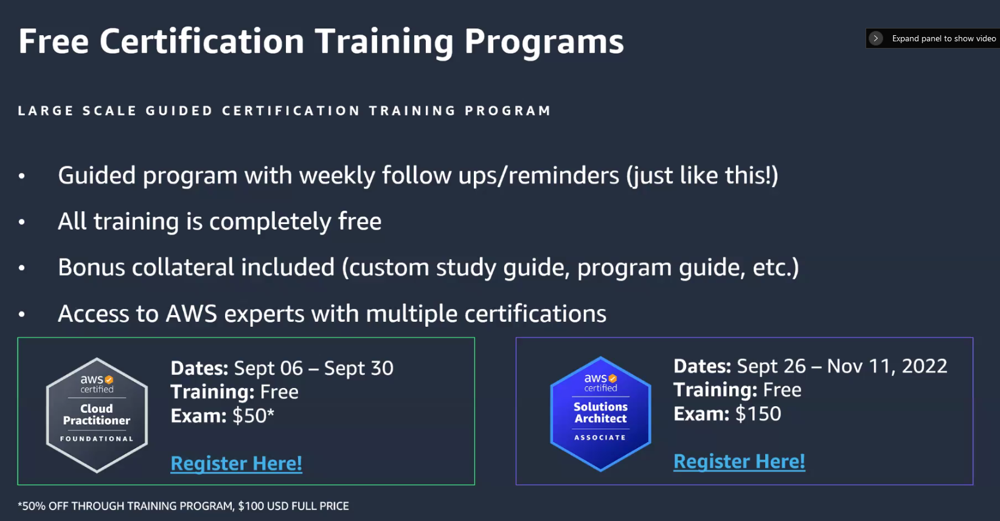
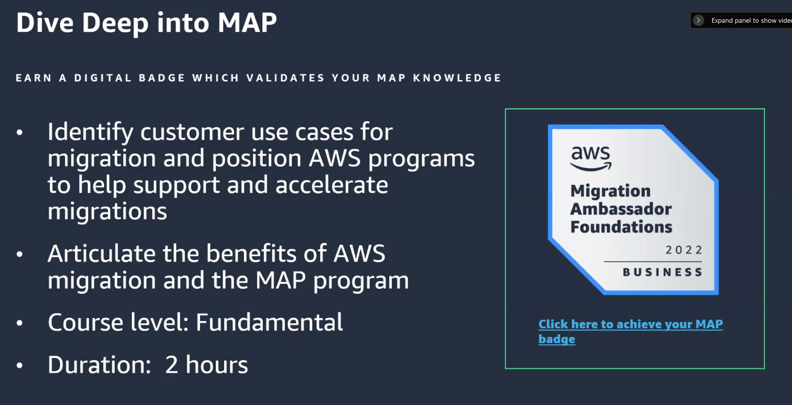

# AWS Training: Program Recap & Next Steps

### [Program Guide](http://d1zkqv7c4vgdzp.cloudfront.net/MPPSales2/programguide.pdf)

---

## Agenda

- Program Team Overview
- Weekly calendar review
- Skill builder overview
- Recommended partner training next steps

## Skill Builder Overview

- Role-based learning paths
- Individual subscription
  - $29.99/month
  - Digital self-paced labs
  - Practice exams for AWS certs
  - Recommended to buy for a month or so when preparing for specific exams
  - 100 AWS labs
- Team subscription
  - Admin feature
  - Assign and track training to employees
  - Jams - team-based collaborative labs

## Next Steps

- [ ] Finish Cloud Economics Accreditation

